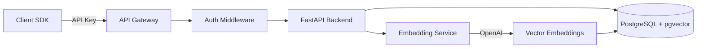
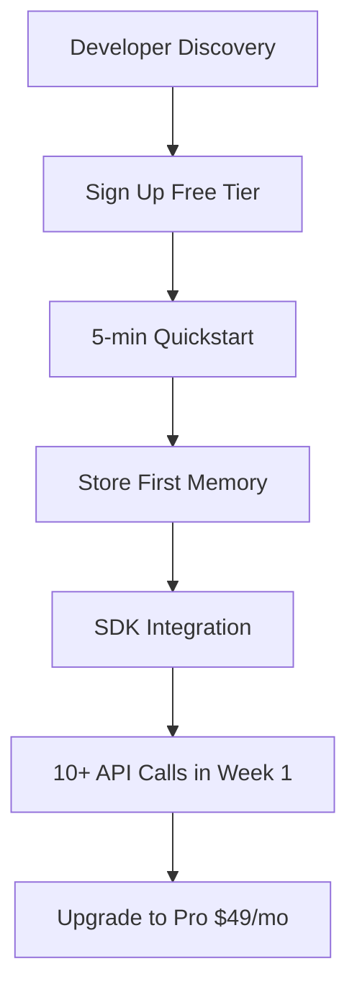

# Antler Startup Launch Plan

## Executive Summary

Transform Antler from prototype to venture-backed startup with a beta launch in 3 months. Focus on self-serve customer acquisition across developers, AI startups, and enterprise segments while building traction metrics for seed fundraising.

## Phase 1: Technical Foundation (Weeks 1-4)

### Backend API Development

Build production-ready FastAPI backend with core memory operations:

- **API Endpoints** - Create RESTful API in new [`python/routes/`](python/routes/) directory:
- `POST /memories` - Store memory with automatic embedding generation
- `GET /memories/search` - Semantic search using vector similarity
- `GET /memories` - List/filter by user_id, session_id, tags
- `PUT /memories/{id}` - Update memory content
- `DELETE /memories/{id}` - Remove memory
- `POST /organizations` - Self-service signup
- `GET /organizations/usage` - Track operations and storage
- **Authentication Middleware** - API key validation using [`python/models/organization.py`](python/models/organization.py) for multi-tenant security
- **Rate Limiting** - Implement plan-based throttling (free: 100 req/day, pro: 10K req/day)
- **Database Migrations** - Set up Alembic migrations for schema versioning

### SDK Development

Create developer-friendly client libraries:

- **Python SDK** (`sdks/python-antler/`)
- Sync/async clients with automatic retries
- Type hints and comprehensive docstrings
- Integration with LangChain, LlamaIndex
- Example: `memory.store("user said X")`, `memory.recall("what did user say?")`
- **JavaScript/TypeScript SDK** (`sdks/js-antler/`)
- NPM package for Node.js and browser
- React hooks: `useMemory()`, `useMemorySearch()`
- Next.js integration examples

### Infrastructure Setup

Production-grade deployment:

- **Hosting**: Railway/Render for backend (with auto-scaling), Vercel for frontend
- **Database**: Managed PostgreSQL with pgvector (Neon/Supabase) - automated backups
- **CI/CD**: GitHub Actions for automated testing and deployment
- **Monitoring**: Sentry for errors, Prometheus + Grafana for metrics
- **Security**: SSL/TLS, environment variables in secrets manager, API key encryption

## Phase 2: Product Development (Weeks 5-8)

### Core Features

- **Smart Deduplication** - Detect similar memories (>95% similarity) and merge automatically
- **Memory Decay** - Optional time-based relevance scoring for recency bias
- **Batch Operations** - Bulk import/export for migration from other systems
- **Memory Collections** - Namespace isolation for different agents/projects
- **Webhook Notifications** - Real-time alerts for memory storage/retrieval events

### Dashboard Development

Build customer portal in [`frontend/app/dashboard/`](frontend/app/dashboard/):

- Authentication with Clerk or Auth0
- Usage analytics (operations, storage, API calls over time)
- API key management with rotation
- Billing portal with Stripe integration
- Memory browser for debugging
- Plan upgrade flow with social proof

### Integrations (Differentiation Strategy)

Pre-built connectors to accelerate adoption:

- **LangChain Integration** - Custom memory class for agents
- **AutoGPT/BabyAGI** - Drop-in memory replacement
- **Zapier/Make** - No-code memory actions
- **Slack/Discord** - Bot memory persistence
- **Chrome Extension** - Personal AI assistant memory

### Documentation Site

Build docs site at [`docs/`](docs/) (Nextra or Docusaurus):

- Quickstart guide (5-minute integration)
- API reference with interactive examples
- SDK documentation with code snippets
- Use case tutorials (chatbot, personal assistant, autonomous agent)
- Migration guides from alternatives (Pinecone, Weaviate)
- Video walkthrough for onboarding

## Phase 3: Go-to-Market Strategy (Weeks 9-12)

### Pre-Launch Activities (Week 9-10)

**Community Building**

- Launch on Product Hunt, Hacker News, Reddit (r/MachineLearning, r/LangChain)
- Start Twitter/X account - daily tips on AI memory architecture
- Create Discord/Slack community for early users
- Guest posts on AI engineering blogs (Towards Data Science, The Pragmatic Engineer)

**Beta Program**

- Recruit 50 beta users offering free Pro plan for 6 months
- Target: 10 AI startups, 30 developers, 10 enterprise prospects
- Weekly feedback calls + feature prioritization survey
- NPS tracking for product-market fit signal

**Content Marketing**

- Publish technical blog posts:
- "Building Production AI Agents with Persistent Memory"
- "Why Vector Databases Aren't Enough for AI Memory"
- "Memory Architecture Patterns for LLM Applications"
- Create comparison page vs Pinecone, Weaviate, Chroma (focus on simplicity + DX)
- Record demo videos and tutorials

### Launch Strategy (Week 11-12)

**Beta Launch**

- Coordinated launch on Product Hunt (aim for #1 Product of the Day)
- Hacker News "Show HN" post with technical deep dive
- Email announcement to waitlist (build waitlist during weeks 1-10)
- Press outreach to TechCrunch, VentureBeat (AI infrastructure angle)

**Developer Relations**

- Host webinar: "Building Smarter AI Agents with Antler"
- Sponsor AI hackathons with free credits
- Office hours for integration support
- Contributor program for open-source examples

**Partnership Outreach**

- OpenAI, Anthropic partner programs
- LangChain official integrations list
- Vercel marketplace listing
- AWS/GCP startup programs for co-selling

### Customer Acquisition Channels

**Self-Serve Funnel**

Target metrics: 40% signup → first API call, 15% activation → upgrade conversion**Growth Tactics**

- SEO for "AI agent memory", "LangChain memory", "chatbot memory persistence"
- GitHub sponsorships on popular AI repos (LangChain, AutoGPT)
- Referral program: 1 month free Pro for both referrer and referee
- DevRel on Twitter - engage with AI builders, share memory patterns

## Phase 4: Business Model & Metrics

### Pricing Strategy (Refined)

| Tier | Price | Memory Ops | Storage | Target Segment | Annual Value ||------|-------|-----------|---------|----------------|--------------|| **Free** | $0 | 10K/mo | 1 GB | Hobbyists, prototypes | $0 || **Starter** | $19/mo | 100K/mo | 10 GB | Solo developers, side projects | $228 || **Pro** | $79/mo | 1M/mo | 100 GB | Startups, production apps | $948 || **Team** | $299/mo | 10M/mo | 1 TB | Small teams, multiple projects | $3,588 || **Enterprise** | Custom | Unlimited | Unlimited | Large companies, on-prem | $50K+ |**Pricing Philosophy**: Land with free, expand to Pro at scale, capture teams for collaboration features

### Unit Economics

**Customer Acquisition Cost (CAC)**

- Self-serve: $50 (content, SEO, community)
- Outbound sales (enterprise): $5,000

**Cost of Goods Sold (COGS) per Pro Customer**

- Database hosting: $10/mo (managed PostgreSQL)
- OpenAI embeddings: $8/mo (1M operations × $0.000008/embedding)
- Infrastructure: $4/mo (compute, CDN)
- **Total COGS: $22/mo**

**Gross Margin**: ($79 - $22) / $79 = **72%Payback Period**: $50 CAC / ($79 - $22) = **0.9 months** (excellent for SaaS)**Lifetime Value (LTV)**

- Assumption: 24-month average customer lifetime, 5% monthly churn
- LTV = $79 × 24 × 0.7 (accounting for churn) = **$1,327**
- LTV/CAC = $1,327 / $50 = **26.5x** (target >3x)

### Key Metrics Dashboard

**North Star Metric**: Monthly Active API Keys (MAAK)**Pirate Metrics (AARRR)**

- **Acquisition**: Website visitors → signups (track sources)
- **Activation**: Signups → first API call within 24h (target 40%)
- **Retention**: D7, D30 retention cohorts (target 60% D30)
- **Revenue**: Free → Paid conversion (target 10% after 10K ops)
- **Referral**: Virality coefficient (target 0.3+)

**Product Metrics**

- Average memories per user
- Average search latency (p50, p95, p99)
- API error rate (target <0.1%)
- Embedding success rate

**Financial Metrics**

- Monthly Recurring Revenue (MRR)
- Net Revenue Retention (NRR) - target >100%
- CAC Payback Period (target <12 months)
- Annual Run Rate (ARR)

### Revenue Projections (Conservative)

**Month 3 (Beta Launch)**

- 500 free users, 25 paid ($19-79 avg = $49), MRR: $1,225

**Month 6**

- 2,000 free users, 150 paid, MRR: $7,350

**Month 12**

- 8,000 free users, 800 paid, 2 enterprise ($5K/mo), MRR: $49,200 (ARR: $590K)

**Break-even**: Month 8-9 with lean team of 3

## Phase 5: Fundraising Strategy

### Pre-Seed / Seed Round Target

**Raise Amount**: $1.5M - $2M seed round

- 18-month runway with team of 6
- Use: Engineering (3), GTM (2), Operations (1)

**Valuation Target**: $8M - $10M post-money

- Comparable to recent AI infra seed rounds (Helicone: $5M @ $25M, LangSmith: $25M)

### Traction Milestones for Fundraise (Weeks 1-12)

**Pre-Launch (Week 1-8)**

- 500+ waitlist signups
- 10 design partner agreements
- MVP live with 50 beta users

**Post-Launch (Week 9-12)**

- 1,000+ signups
- 50+ paying customers
- $2,500+ MRR
- 10+ GitHub stars, 5+ case studies
- Featured on Product Hunt, Hacker News front page

### Pitch Deck Structure

**Slides (10-12 total)**

1. **Hook**: "Every AI agent forgets. We fix that."
2. **Problem**: AI systems are stateless, context window limits, memory is expensive
3. **Solution**: Purpose-built memory infrastructure with semantic search
4. **Product Demo**: 3-line code example showing before/after
5. **Market Size**: $50B AI infrastructure TAM, $5B serviceable (Gartner)
6. **Business Model**: Self-serve SaaS with enterprise expansion
7. **Traction**: Beta metrics, customer testimonials, growth chart
8. **Competition**: Positioning vs vector DBs (we're purpose-built for AI memory)
9. **Go-to-Market**: Developer-led growth → team adoption → enterprise
10. **Team**: Backgrounds in AI, infrastructure, enterprise SaaS
11. **Vision**: Become the standard memory layer for AI agents
12. **Ask**: $1.5M seed to reach $50K MRR in 12 months

### Investor Targeting

**Ideal Investor Profile**

- AI/ML infrastructure focus (Madrona, Amplify, Essence VC)
- Developer tools experience (Heavybit, Uncork Capital)
- Seed-stage, hands-on with network in AI ecosystem
- Previous investments: LangChain, Pinecone, Modal, Replicate

**Warm Intro Strategy**

- Leverage beta customers at portfolio companies
- Connect via YC, TinySeed, or other accelerator alumni
- Intros from existing angels/advisors
- LinkedIn reach out to partners with AI thesis

**Fundraising Timeline**

- Month 1-2: Prep deck, model, data room
- Month 3: Launch beta, generate traction
- Month 4: Start outreach (aim for 30 meetings)
- Month 5-6: Partner meetings, term sheets
- Month 7: Close round

### Alternative: Bootstrapping Path

If choosing to bootstrap instead:

- Focus on profitability by month 6
- Grow slower: target $10K MRR by month 12
- Solo founder or small team (1-2)
- Minimize COGS: use serverless (Vercel, PlanetScale, Fly.io)
- Revenue-based financing if needed ($50K-$250K from Calm Fund, Earnest Capital)

## Phase 6: Competitive Strategy

### Positioning

**Antler vs Vector Databases (Pinecone, Weaviate, Chroma)**

- **We**: Purpose-built for AI memory with context management
- **They**: General vector search, requires complex setup

**Antler vs LangChain Memory**

- **We**: Centralized, persistent, scalable cloud service
- **They**: Local, ephemeral, requires self-hosting

**Unique Value Proposition**: "The memory layer your AI agents deserve - 3 lines of code, production-ready"

### Differentiation

1. **Developer Experience**: SDK-first, 5-minute integration vs days of setup
2. **AI-Native Features**: Session management, automatic deduplication, memory decay
3. **Multi-Modal Support** (future): Images, audio, video memory
4. **Privacy-First**: On-prem deployment for enterprise, SOC 2 compliance
5. **Ecosystem**: Pre-built integrations vs build-it-yourself

### Moats (Long-term)

- **Network effects**: More users → more use cases → better templates
- **Data moat**: Aggregate learnings on optimal memory architectures
- **Switching costs**: Once integrated, hard to migrate memory data
- **Brand**: Become synonymous with "AI memory" (like "Stripe for payments")

## Risk Mitigation

### Technical Risks

- **OpenAI dependency**: Build adapter pattern for multiple embedding providers (Cohere, Voyage AI)
- **Vector DB scaling**: Start with pgvector, plan migration to specialized vector DB if needed
- **Downtime**: Multi-region deployment, 99.9% SLA for enterprise

### Market Risks

- **AI winter**: Focus on use cases with proven ROI (customer support, personal assistants)
- **Commoditization**: Build moats through DX, integrations, brand
- **Incumbent competition**: Move fast, own developer community before AWS/Azure launches

### Execution Risks

- **Hiring**: Use contractors initially, convert to full-time after funding
- **Burn rate**: Keep team lean (<$30K/mo) until product-market fit
- **Founder burnout**: Set 3-month sprints with clear milestones

## Success Criteria (3-Month Beta)

**Product**

- [ ] API live with 99.5% uptime
- [ ] Python + JS SDKs published to PyPI/NPM
- [ ] 10+ integrations (LangChain, AutoGPT, etc.)
- [ ] Documentation site with 20+ examples

**Traction**

- [ ] 1,000+ signups (free + paid)
- [ ] 50+ paying customers
- [ ] $2,500+ MRR ($30K ARR)
- [ ] 60% D30 retention
- [ ] NPS score >40

**Community**

- [ ] 500+ GitHub stars
- [ ] 200+ Discord members
- [ ] 5+ case studies/testimonials
- [ ] Top 5 Product Hunt launch

**Fundraising-Ready**

- [ ] Pitch deck finalized
- [ ] Financial model built (5-year projections)
- [ ] Data room prepared (metrics dashboard)
- [ ] 10+ warm investor intros

## Next Steps (Week 1 Priorities)

1. **Set up project management**: Linear/GitHub Projects for task tracking
2. **Build backend API**: Start with memory CRUD endpoints in [`python/routes/memories.py`](python/routes/memories.py)
3. **Deploy infrastructure**: Provision Railway/Render backend + Neon PostgreSQL
4. **Create landing page waitlist**: Add email capture to [`frontend/app/page.tsx`](frontend/app/page.tsx)
5. **Investor research**: Build CRM of 50 target seed investors
6. **Design partner outreach**: Email 20 potential beta customers